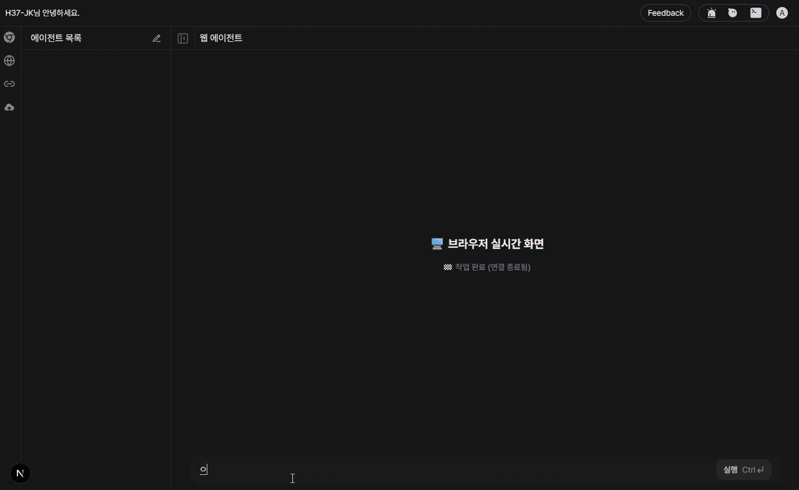
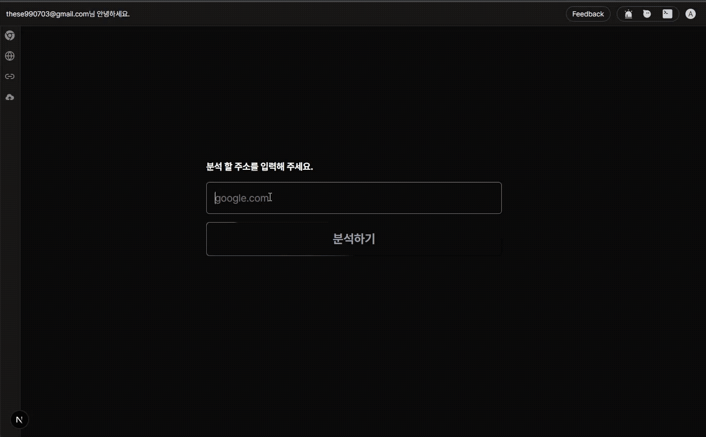
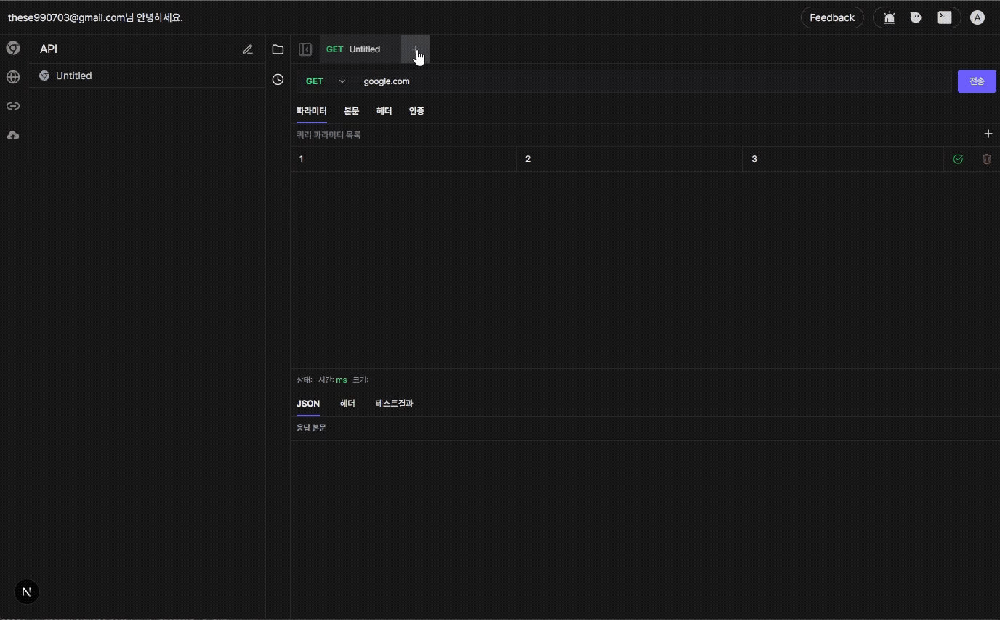
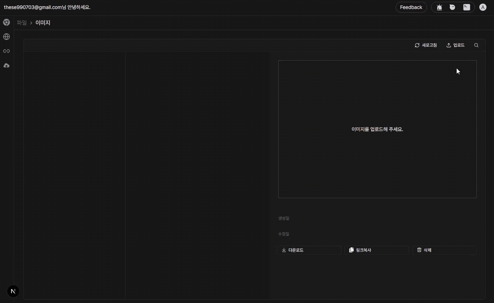

## 🎯 어떤 프로젝트인가?

제가 만들어보고 싶었던 기능을 대시보드 형식으로 종합하여 만든 프로젝트 입니다.
웹 에이전트를 이용한 브라우저 자동화, 웹체크, API 테스트, 스토리지 기능이 있습니다.
[프로젝트 링크](http://h37-project.duckdns.org:3000/)

## ✨ 기능
- **웹 에이전트**: browser-use를 보고 영감을 받아 만든 기능 입니다. 요청을 입력 받으면 Playwright와, AI를 이용해 브라우저 상에서 요청 받은 대로 자동으로 작업 해줍니다.
- **웹 체크**: web-check를 보고 영감을 받아 만든 기능 입니다. 서버 주소를 입력 받으면, 서버 정보, whois 정보, SSL 정보, 경도, 위도, 지역등 각종 정보들을 알려줍니다.
- **API**: postman, hopscotch 처럼 API를 테스트 할 수 있는 기능 입니다. 디자인은 hopscotch를 보고 만들었습니다.
- **스토리지**: 이미지나, 비디오를 저장하여 다운로드, 미리보기등을 제공하는 기능 입니다.

## 🌐 웹 에이전트



## 🔎 웹 체크



## 💻 API



## 🧰 스토리지




## 📦 기술 스택

| 분류 | 프레임워크 | 라이브러리 |
| :--- | :--- | :--- |
| **Backend** | **FastAPI** (Python) | `asyncio, asyncssh, asyncwhois, authlib, cryptography, dnspytho, google-generativeai, httpx, loguru, openpyxl, pandas, pillow, playwright, playwright-stealth, pyjwt, paramiko, passlib, sqlmodel, sqlparse, websockets ` |
| **Frontend** | **Next.js** (TypeScript) | `codemirror, hookform, tailwindcss, axios, framer-motioin, lodash, lucide-react, next-auth, react-hook-form, react-icons, react-markdown, react-syntax-highligher, swr, zod, zustand` |

## 🚀 시작하기

- **도커** - postgres(필수)
- **로그** (선택):
    - **grafana**
    - **promtail**
    - **loki**
### postgres 설치

```bash
cd docker 
docker compose -up d
```

### FastAPI 시작
```bash
cd backend 
uv sync 
fastapi dev main.py --host 0.0.0.0
```

### NextJS 시작
```bash
# 패키지 설치
cd frontend
npm run dev
```

## 📊 Sample Reports

Sample penetration test reports from industry-standard vulnerable applications:

#### 🧃 **OWASP Juice Shop** • [GitHub](https://github.com/juice-shop/juice-shop)

*A notoriously insecure web application maintained by OWASP, designed to test a tool's ability to uncover a wide range of modern vulnerabilities.*

**Results**: Identified over 20 vulnerabilities across targeted OWASP categories in a single automated run.

**Notable findings**:

- Authentication bypass and full user database exfiltration via SQL injection
- Privilege escalation to administrator through registration workflow bypass
- IDOR vulnerabilities enabling access to other users' data and shopping carts
- SSRF enabling internal network reconnaissance
